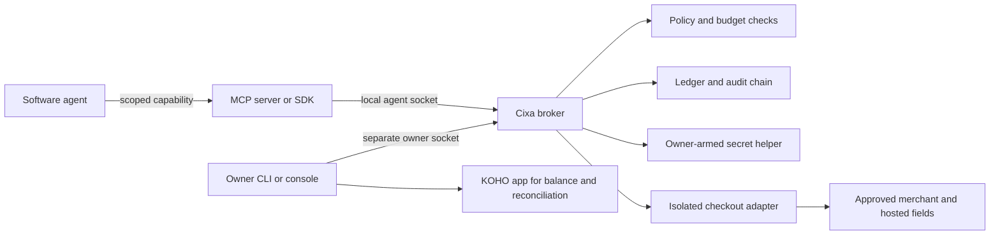

<p align="center">
  
</p>

<h1 align="center">Cixa</h1>

<p align="center">
  <strong>A local checkout firewall for software agents.</strong><br>
  Let agents buy what you allow, without handing them the keys to your money.
</p>

<p align="center">
  <a href="LICENSE"></a>
  
  
  
  
</p>

<p align="center">
  <a href="#try-the-demo">Demo</a> ·
  <a href="#owner-console">Screenshots</a> ·
  <a href="#connect-an-agent">Agent setup</a> ·
  <a href="docs/architecture.md">Architecture</a> ·
  <a href="SECURITY.md">Security</a>
</p>

<p align="center">
  
</p>

## What is Cixa?

Cixa sits between an autonomous agent and real money.

An agent can ask to make a purchase. Cixa checks the amount, merchant, currency, checkout details, and the limits you set. Safe requests can continue, questionable ones wait for you, and anything ambiguous stops instead of guessing.

Your agent does **not** receive your card number, account login, owner token, or permission to increase its own budget. Cixa runs locally, uses separate Unix sockets for agents and owner controls, and keeps a ledger of what happened.

With a deliberately configured KOHO card, Cixa can also complete a real hosted-fields checkout for an approved merchant. The card exists only inside a short-lived owner-armed helper process. The agent supplies the shopping facts; Cixa independently checks the page, fills the isolated payment frame, submits once, then waits for you to confirm the result against KOHO. There is no private KOHO API or account scraping hiding underneath it.

The name comes from Laz. **Cixa** means fortress or castle. It is pronounced roughly **JEE-kha**, with the `x` sounding like the `ch` in *Bach* or *loch*.

## Why use it?

Giving an agent a payment credential directly leaves a lot of awkward questions:

- What if the total changes at checkout?
- What if a free trial quietly becomes a subscription?
- What if the payment times out after submission?
- Can one agent spend another agent's allowance?
- Who can pause everything when something looks wrong?

Cixa gives those questions one small, explicit boundary. It can:

- enforce per-purchase, per-session, rolling 24-hour, and lifetime limits;
- keep each agent on its own scoped, expiring, revocable capability;
- allow, deny, or ask you about a checkout based on the current policy;
- block unexpected currencies, merchants, redirects, recurring charges, and changed totals;
- keep unknown payment outcomes quarantined for reconciliation instead of retrying;
- complete owner-approved hosted-fields checkouts while a short payment session is armed;
- share public receiving instructions without exposing a login or treating a notification as cleared money;
- record an append-only ledger and tamper-evident audit chain;
- stop all spending immediately from the CLI or owner console.

## Try the demo

The demo is the easiest way to see the whole flow. It uses fake money, synthetic credentials, and a simulated provider. No account or API key is needed, and no real transaction is made.

You will need:

- Rust stable
- Node.js 20 or newer
- npm
- Python 3.11 or newer
- Chrome or Chromium for browser checks

```bash
git clone https://github.com/BedirT/cixa.git
cd cixa
npm ci
./scripts/demo
```

The demo covers a normal bounded purchase, duplicate protection, an over-budget request, a recurring-payment attempt, a currency switch, a hostile checkout form, emergency stop, audit verification, and a secret-canary scan.

If Chrome is installed somewhere unusual, set `CIXA_BROWSER_EXECUTABLE` to its absolute path.

## Owner console

The owner console is the human side of Cixa. It is intentionally small and practical:

- **Today** shows what needs your attention, what was spent, and what is still allowed.
- **Ledger** keeps every purchase attempt, including stopped and uncertain ones.
- **Agents** lets you set authority, limits, trusted merchants, and short spending sessions.
- **Trust** makes the provider, local-storage, receiving, and audit boundaries visible.
- **Provider setup** connects a KOHO card reference, opens an expiring payment session, and pins checkout profiles to approved merchants and processors.

<p align="center">
  
</p>

<table>
  <tr>
    <td width="50%"></td>
    <td width="50%"></td>
  </tr>
  <tr>
    <td align="center"><sub>One allowance and capability per agent</sub></td>
    <td align="center"><sub>Authority, limits, trusted merchants, and revocation</sub></td>
  </tr>
</table>

<details>
  <summary><strong>See the Trust page</strong></summary>
  <br>
  <p align="center">
    
  </p>
</details>

The dashboard loads no CDN assets, analytics, or third-party scripts. It listens on loopback, keeps its access token separate from the broker owner token, and exchanges that token for a random per-process browser session.

### Run the console locally

For the complete owner-side build and private directory setup, run:

```bash
./scripts/setup-owner --data-dir "$HOME/.local/share/cixa"
```

The script builds the Rust broker and browser adapter, installs a dedicated Chromium under the private Cixa directory, creates private owner and dashboard credentials, initializes the checkout helper, and prints the exact broker and console commands for your machine. It never asks for or stores a card number. Use `--skip-browser` only when you will supply another owner-controlled executable that passes Cixa's path checks.

For real agent access, create the dedicated agent identity and IPC group from [Local deployment](docs/deployment.md), then run setup with both shared-boundary arguments:

```bash
./scripts/setup-owner \
  --data-dir "$HOME/.local/share/cixa" \
  --agent-gid "$CIXA_AGENT_GID" \
  --agent-directory "/absolute/group-shared/cixa-agent"
```

The printed broker command then exposes only the group socket, and the owner console writes new capability files as owner-readable, agent-group-readable `0640` files. It does not share the owner data, checkout profiles, browser, or payment session.

Start the printed broker command, then start the printed owner-console command in another terminal. Open `http://127.0.0.1:8765` and unlock it with the contents of the printed `dashboard.token` path.

## Use it with a KOHO card

Cixa deliberately does not use a KOHO API. You set it up from the local owner console:

1. In **Trust → Provider**, enter an owner-controlled credential reference, the last four digits, and the balance you just checked in KOHO.
2. Enable controlled checkout if you want bounded-autonomous agents to submit approved checkouts.
3. Add a checkout profile for each merchant. A profile pins the merchant origin, hosted-fields processor origins, visible checkout facts, form selectors, browser, and timeout.
4. Open a payment session when you are comfortable letting an agent buy. Enter the card only in this local owner form. Cixa passes it directly to a helper process and clears the form. The helper expires after your chosen time or checkout count.
5. Set each agent's mode, limits, approved merchants, and spending-session duration from **Agents**.
6. When a real checkout is submitted, check the KOHO transaction list and reconcile it in Cixa. Without an issuer API, a merchant success page is not authoritative enough to mark money settled.

For receiving money, copy the public third-party e-Transfer address shown by KOHO into **Trust → Receiving**. Agents may share that address and its memo. Only you can verify an arrival and decide how much becomes agent spending authority. Cixa does not send outgoing e-Transfers.

The setup is intentionally a little deliberate. The sensitive half belongs to you; the repeatable shopping work belongs to the agent. Read the friendly [KOHO setup guide](docs/koho-setup.md) and the [deployment boundary](docs/deployment.md) before the first real purchase.

### Start the broker manually

After `scripts/setup-owner`, the controlled-checkout broker command has this shape:

```bash
target/release/cixa serve \
  --data-dir "$HOME/.local/share/cixa" \
  --checkout-runtime-dir "$HOME/.local/share/cixa/checkout-runtime" \
  --checkout-profiles-dir "$HOME/.local/share/cixa/checkout-profiles" \
  --node-path "$(command -v node)" \
  --adapter-script "$PWD/packages/checkout-playwright/dist/index.js"
```

The owner console command has this shape:

```bash
python3 apps/owner-dashboard/server.py \
  --socket-path "$HOME/.local/share/cixa/owner.sock" \
  --owner-token-file "$HOME/.local/share/cixa/owner.token" \
  --access-token-file "$HOME/.local/share/cixa/dashboard.token" \
  --cixa-binary "$PWD/target/release/cixa" \
  --checkout-runtime-directory "$HOME/.local/share/cixa/checkout-runtime" \
  --checkout-profiles-directory "$HOME/.local/share/cixa/checkout-profiles" \
  --checkout-browser-executable "/private/path/printed/by/setup-owner/chrome" \
  --port 8765
```

## How it fits together



The split matters. Agent integrations get the agent socket and one scoped capability token. They do not get the owner socket, data directory, payment credential, audit key, or dashboard handoff.

For a detailed tour, read [Architecture](docs/architecture.md), [Security model](docs/security-model.md), and the full [Threat model](THREAT_MODEL.md).

## Connect an agent

Create an agent capability from the owner console, or while the broker is stopped:

```bash
target/debug/cixa create-agent \
  --data-dir .local \
  --owner-token-file .local/owner.token \
  --agent-token-file .local/research-runner.token \
  --mode approval_required
```

Start the broker again, then choose whichever integration suits the agent.

### MCP

```bash
npm run build

CIXA_SOCKET_PATH="$PWD/.local/cixa.sock" \
CIXA_AGENT_TOKEN_FILE="$PWD/.local/research-runner.token" \
node packages/mcp-server/dist/index.js
```

The MCP server exposes the agent-safe surface for reading its budget, proposing or executing purchase intents, cancelling unexecuted intents, listing sanitized transactions, reading receiving instructions, and reading sanitized receipts. Owner actions never appear as MCP tools.

### Install the agent skill

Cixa ships one Agent Skills-compatible package for Codex and Claude Code:

```bash
./scripts/install-agent-skill --target all
```

It installs `cixa-payments` into `~/.codex/skills/` and `~/.claude/skills/`. The skill teaches an agent the exact purchase contract, state handling, no-retry rule, receiving flow, and credential boundary. It does not grant access by itself.

Copy [`examples/mcp-agent-config.json`](examples/mcp-agent-config.json), replace its absolute paths, and add it to your agent host. For Claude Code, the same object can live in a project `.mcp.json`; for Codex, add the server through its MCP configuration. Give the MCP process only the agent socket and that agent's token file.

For a real card, run the agent integration under a distinct OS identity or container. This is not ceremony for ceremony's sake: an unrestricted coding agent running as the same user as the owner could read any owner-readable file. [Local deployment](docs/deployment.md) shows the safe socket, group, and service layout.

### TypeScript

```ts
import { BrokerClient } from "cixa-sdk";

const cixa = new BrokerClient({
  socketPath: process.env.CIXA_SOCKET_PATH!,
  tokenFile: process.env.CIXA_AGENT_TOKEN_FILE!,
});

console.log(await cixa.getBudget());
```

### Python

```python
from cixa import CixaClient

cixa = CixaClient(".local/cixa.sock", ".local/research-runner.token")
print(cixa.get_budget())
```

There are complete examples in [`examples/`](examples) and a step-by-step [agent integration guide](docs/agent-integration.md).

## Authority modes

| Mode | What happens |
| --- | --- |
| `observe` | The agent can inspect its Cixa state but cannot buy. |
| `approval_required` | A valid checkout waits for the owner to allow it once. |
| `bounded_autonomous` | A valid checkout may continue inside its fixed policy and active session. |
| `disabled` | Spending is paused. |

An agent cannot promote itself to a stronger mode, edit its policy, approve its own purchase, or turn a one-time approval into permanent merchant trust.

## A few important limits

Cixa is a public alpha with a complete local simulator and a deliberately bounded real-card path. The real path is useful today for merchant profiles you configure and test, but it is not a universal browser wallet.

Cixa is not a bank, wallet, issuer, payment processor, custodial service, universal checkout system, or claim of PCI DSS compliance. It does not automate issuer logins or private banking APIs. This repository and its test suite do not make real transactions.

Keep these rules in mind:

- Treat agents and merchant pages as hostile input.
- Never place real card details, account logins, owner tokens, agent tokens, or audit keys in prompts, source, logs, screenshots, traces, or MCP output.
- A timeout after payment submission is ambiguous. Cixa records it for owner reconciliation and does not automatically retry.
- The durable manual-provider record stores an owner-controlled credential reference and masked metadata, not the card itself. While armed, the short-lived helper process necessarily holds the card in memory until expiry or its checkout limit.
- Real browser submissions become `unknown` or `reconciliation_required` until you check KOHO. This is how Cixa avoids inventing provider certainty without an API.
- A compromised administrator, operating-system kernel, browser runtime, issuer, merchant, or owner is outside some guarantees.
- Passing tests is useful evidence, not a security warranty.

Before connecting anything beyond the simulator, read [Security](SECURITY.md), [Credential handling](docs/credential-handling.md), [Deployment](docs/deployment.md), and [Known limitations](docs/limitations.md).

## Development

Run the full local verification gate with:

```bash
./scripts/verify
```

The full gate checks formatting, Rust and SDK builds, tests, fuzz-harness compilation, package installation, persisted daemon behavior, the owner console, adversarial scenarios, documentation, dependency licenses, SBOM generation, vulnerability scans, and secret canaries.

It expects the pinned Python build tools from `requirements-build.lock`, plus `pip-audit` 2.9.0, `cargo-audit` 0.22.2, and `gitleaks` 8.30.1.

Small, focused contributions are welcome. Please start with [Contributing](CONTRIBUTING.md). If you find a security issue, use the private process in [Security](SECURITY.md) rather than opening a public issue with sensitive details.

## License

Cixa is available under the [Apache License 2.0](LICENSE).
