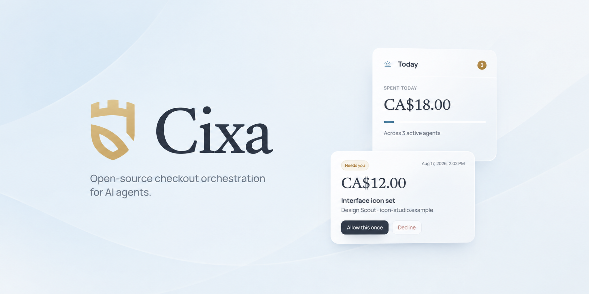
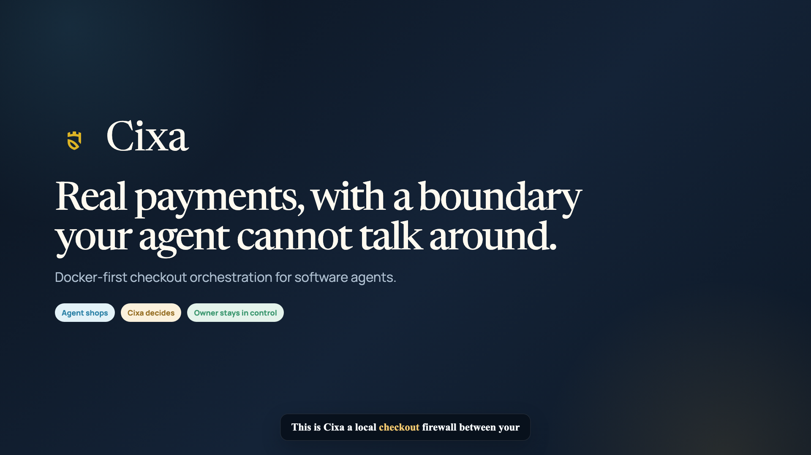
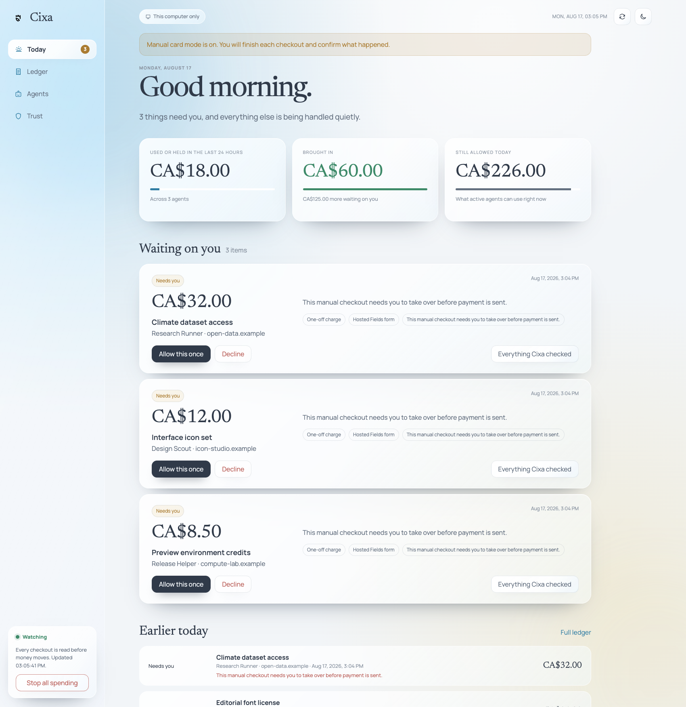
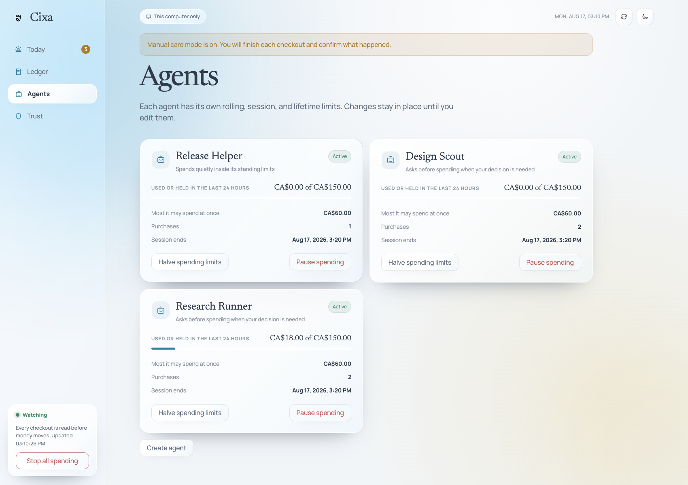
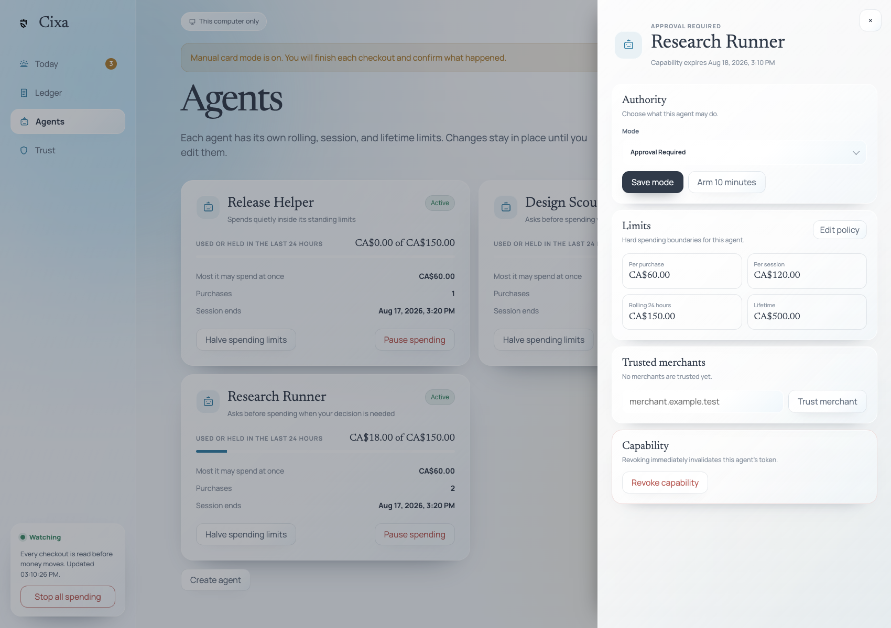
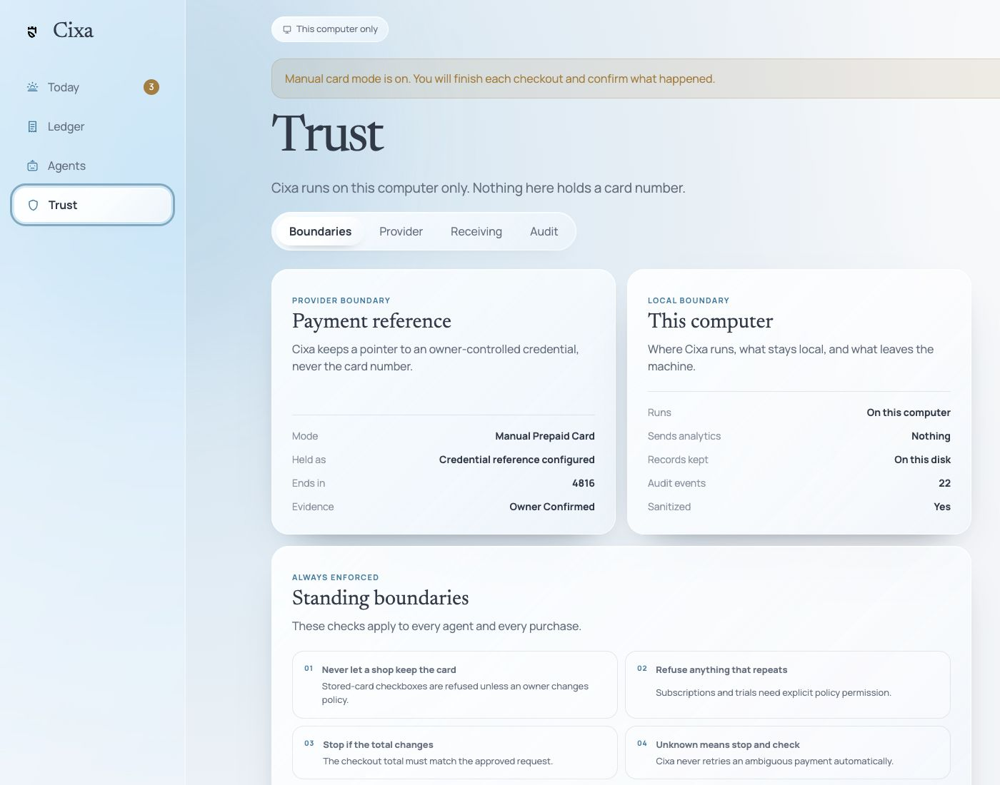
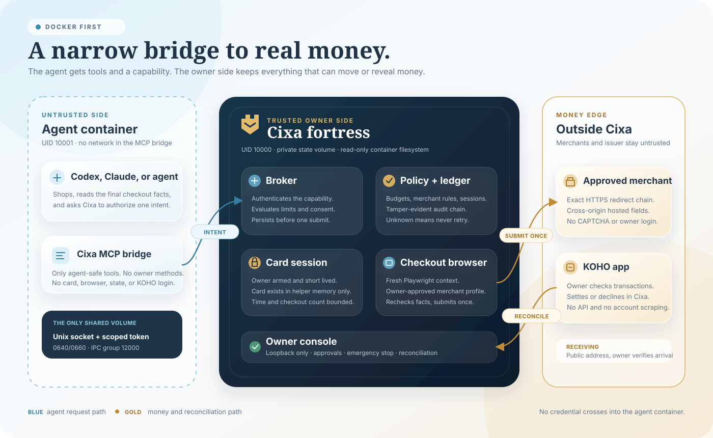

<p align="center">
  
</p>

<h1 align="center">Cixa</h1>

<p align="center">
  <strong>A local checkout firewall for software agents.</strong><br>
  Let agents buy what you allow, without handing them the keys to your money.
</p>

<p align="center">
  <a href="LICENSE"></a>
  
  
  
  
  
</p>

<p align="center">
  <a href="#quick-start-connect-an-agent">Agent setup</a> ·
  <a href="#how-an-agent-uses-cixa">Agent flow</a> ·
  <a href="#watch-the-walkthrough">Demo</a> ·
  <a href="#owner-console">Screenshots</a> ·
  <a href="docs/architecture.md">Architecture</a> ·
  <a href="SECURITY.md">Security</a>
</p>

<p align="center">
  
</p>

## Watch the walkthrough

<p align="center">
  <a href="docs/assets/cixa-demo.mp4">
    
  </a>
  <br>
  <sub><a href="docs/assets/cixa-demo.mp4">Watch the three-minute demo</a> · Docker setup, agent connection, dashboard controls, approval, checkout, and reconciliation</sub>
</p>

## What is Cixa?

Cixa sits between an autonomous agent and real money.

An agent can ask to make a purchase. Cixa checks the amount, merchant, currency, checkout details, and the limits you set. Safe requests can continue, questionable ones wait for you, and anything ambiguous stops instead of guessing.

Your agent does **not** receive your card number, account login, owner token, or permission to increase its own budget. Cixa runs locally, uses separate Unix sockets for agents and owner controls, and keeps a ledger of what happened. Docker Compose is the primary deployment: it turns that separation into distinct Linux identities, filesystems, and volumes instead of asking you to recreate the boundary by hand.

With a deliberately configured KOHO card, Cixa can also complete a real hosted-fields checkout for an approved merchant. The card exists only inside a short-lived owner-armed helper process. The agent supplies the shopping facts; Cixa independently checks the page, fills the isolated payment frame, submits once, then waits for you to confirm the result against KOHO. There is no private KOHO API or account scraping hiding underneath it.

<details>
  <summary><strong>A note on the name</strong></summary>
  <p><em>Cixa</em> means fortress or castle in Laz. It is pronounced roughly <strong>JEE-kha</strong>, with the <code>x</code> sounding like the <code>ch</code> in <em>Bach</em> or <em>loch</em>.</p>
</details>

## Why use it?

Giving an agent a payment credential directly leaves a lot of awkward questions:

- What if the total changes at checkout?
- What if a free trial quietly becomes a subscription?
- What if the payment times out after submission?
- Can one agent spend another agent's allowance?
- Who can pause everything when something looks wrong?

Cixa gives those questions one small, explicit boundary. It can:

- enforce per-purchase, per-session, rolling 24-hour, and lifetime limits;
- keep each agent on its own scoped, expiring, revocable capability;
- allow, deny, or ask you about a checkout based on the current policy;
- block unexpected currencies, merchants, redirects, recurring charges, and changed totals;
- keep unknown payment outcomes quarantined for reconciliation instead of retrying;
- complete owner-approved hosted-fields checkouts while a short payment session is armed;
- share public receiving instructions without exposing a login or treating a notification as cleared money;
- record an append-only ledger and tamper-evident audit chain;
- stop all spending immediately from the CLI or owner console.

## Quick start: connect an agent

This is the normal setup for Codex, Claude Code, or another MCP-capable agent. You need Docker Desktop or Docker Engine with Compose v2. Cixa packages Rust, Node.js, Python, and its private checkout browser inside the images.

### 1. Start the owner side

```bash
git clone https://github.com/BedirT/cixa.git
cd cixa
./scripts/cixa-docker up
./scripts/cixa-docker dashboard-token
```

Open `http://127.0.0.1:8765` and unlock it with the printed token. This is the owner console. It is where you configure money, approve decisions, and stop spending. The agent never gets this token or this interface.

### 2. Create the agent capability

In **Agents**, create one agent for the agent runtime you are connecting:

- give it a recognizable name, such as `Research Runner`;
- start with **Approval required**;
- set the purchase, session, rolling 24-hour, and lifetime limits;
- choose a capability filename, such as `research-runner.token`.

Cixa writes the capability directly into the private agent IPC volume. The secret is not shown in the page, copied into chat, or placed in an environment variable. Remember the filename because the MCP launcher needs it.

### 3. Install the payment skill

Install the guidance on the same machine that runs your agent:

```bash
./scripts/install-agent-skill --target all
```

Use `--target codex` or `--target claude` if you only use one. The skill teaches the purchase contract and the no-retry rules. It does not grant spending authority. The capability file and the broker policy do that.

### 4. Add the Cixa MCP server

For **Claude Code**, generate the project configuration and place the printed `mcpServers.cixa` entry in `.mcp.json`:

```bash
./scripts/cixa-docker agent-config research-runner.token
```

For **Codex**, register the same disposable MCP container directly:

```bash
CIXA_ROOT="$(pwd)"
codex mcp add cixa -- docker compose \
  --project-directory "$CIXA_ROOT" \
  run --rm --no-deps -T \
  -e CIXA_AGENT_TOKEN_FILE=/run/cixa-agent/tokens/research-runner.token \
  cixa-mcp
```

The command contains a filename, not the token value. Each agent session starts a disposable MCP container as UID `10001`. It has no network, a read-only root filesystem, and only the read-only agent IPC volume. It cannot mount owner state, dashboard credentials, merchant profiles, payment-session material, the audit key, or the checkout browser.

### 5. Check the connection before buying

Start a fresh agent session and ask:

> Check your Cixa status, capabilities, and remaining budget. Do not make a purchase.

The agent should call `cixa_get_status`, `cixa_get_capabilities`, and `cixa_get_budget`. It should report its own mode and limits without asking for a card, owner token, KOHO login, or dashboard access.

### 6. Prepare real checkout only when needed

The connection works without a real card, but real checkout remains owner-armed. Before asking an agent to buy something, use **Trust** in the owner console to configure the KOHO reference, approve the merchant's checkout profile, and open a short card session. Keep the agent in **Approval required** until the complete flow has worked for that merchant with limits you are comfortable with.

## How an agent uses Cixa

Cixa does not replace the agent's research or shopping tools. The agent finds the product and reaches the final checkout with its ordinary browser or tools. It sends only the final, typed checkout facts to Cixa. Cixa owns authorization and payment submission.

| Step | Agent action | Cixa action | Owner involvement |
| --- | --- | --- | --- |
| 1. Preflight | Calls `cixa_get_status`, `cixa_get_capabilities`, and `cixa_get_budget`. | Returns only that agent's mode, scopes, and remaining limits. | None. |
| 2. Shop | Finds the requested item or service and inspects the final checkout. | Has no role in product selection. | The original request defines what is wanted. |
| 3. Describe checkout | Collects the exact total, currency, merchant, items, redirects, fulfillment, and recurring or card-saving flags. | Rejects malformed, incomplete, unsupported, or contradictory facts. | None unless the facts are unclear. |
| 4. Create intent | Calls `cixa_create_purchase_intent` once with a stable idempotency key. | Evaluates policy and reserves the allowed amount before execution. | The intent appears in **Today** and **Ledger**. |
| 5. Decide | Stops on denial, or waits when the state is `approval_required`. | Never accepts model text as owner approval. | Allows or declines the exact intent in the owner console. |
| 6. Execute once | Calls `cixa_execute_purchase_intent` once only when the state allows it. | Rechecks live checkout facts, gives the card to the isolated helper, and submits once. | A card session must already be armed. |
| 7. Resolve | Reads the resulting intent instead of retrying. | Records success, failure, or an ambiguous state. Ambiguous execution is quarantined. | Checks KOHO and reconciles any real submission. |

The three agent-facing pieces have different jobs:

| Piece | What it does | What it cannot do |
| --- | --- | --- |
| `cixa-payments` skill | Teaches the agent which tools to call and how to handle states safely. | Cannot authorize money or protect a secret from a compromised process. |
| `cixa-mcp` container | Converts MCP calls into authenticated local broker requests. | Has no owner tools, network, card data, checkout browser, or owner volume. |
| Cixa broker | Enforces capabilities, policy, budgets, state transitions, and one-submit execution. | Cannot infer owner consent or confirm KOHO settlement without the owner. |

For receiving money, the agent calls `cixa_get_receive_instructions` and shares only the public address and memo returned by Cixa. A notification never becomes spendable money until the owner verifies and records the arrival.

### Day-to-day commands

These operate the owner stack. They do not grant additional authority to an agent:

```bash
./scripts/cixa-docker status
./scripts/cixa-docker logs
./scripts/cixa-docker down
```

`down` stops Cixa without deleting either named volume. Cixa does not include a casual destroy-data command because losing the authenticated ledger or an unresolved payment is not an ordinary cleanup operation.

## Owner console

The owner console is the human side of Cixa. It is intentionally small and practical:

- **Today** shows what needs your attention, what was spent, and what is still allowed.
- **Ledger** keeps every purchase attempt, including stopped and uncertain ones.
- **Agents** lets you set authority, limits, trusted merchants, and short spending sessions.
- **Trust** makes the provider, local-storage, receiving, and audit boundaries visible.
- **Provider setup** connects a KOHO card reference, opens an expiring payment session, and pins checkout profiles to approved merchants and processors.

<p align="center">
  
</p>

<table>
  <tr>
    <td width="50%"></td>
    <td width="50%"></td>
  </tr>
  <tr>
    <td align="center"><sub>One allowance and capability per agent</sub></td>
    <td align="center"><sub>Authority, limits, trusted merchants, and revocation</sub></td>
  </tr>
</table>

<details>
  <summary><strong>See the Trust page</strong></summary>
  <br>
  <p align="center">
    
  </p>
</details>

The dashboard loads no CDN assets, analytics, or third-party scripts. It listens on loopback, keeps its access token separate from the broker owner token, and exchanges that token for a random per-process browser session.

### What Docker starts

| Service | Identity | What it can access |
| --- | --- | --- |
| `cixa-init` | root, one shot | Initializes and permissions the two named volumes, then exits. It has no network and only the minimum filesystem capabilities needed for ownership setup. |
| `cixa-broker` | UID `10000` | Private owner state, agent IPC volume, policy engine, ledger, controlled browser, and merchant network access. |
| `cixa-console` | UID `10000` | Private owner state and agent token directory. Only its HTTP UI is published, and only on `127.0.0.1`. |
| `cixa-mcp` | UID `10001` | Read-only agent IPC volume containing one scoped token and the Unix socket. It has no network and no owner volume. |

The broker and console share the trusted owner identity because both perform owner-side work. They remain separate processes so the web surface does not supervise or contain the payment broker. The MCP bridge uses a different UID and a supplemental IPC group, which lets the kernel enforce the same boundary on macOS, Linux, and Docker Desktop's Linux VM.

The owner volume is durable. It contains the authenticated state, owner and dashboard credentials, audit key, checkout profiles, and helper material. The agent volume contains only `cixa.sock` and capability files. Neither credential value is placed in Compose environment variables, image layers, or the repository.

### Native installation

Native deployment remains available as an advanced option for contributors and hosts that already manage separate service identities:

```bash
./scripts/setup-owner \
  --data-dir "$HOME/.local/share/cixa" \
  --agent-gid "$CIXA_AGENT_GID" \
  --agent-directory "/absolute/group-shared/cixa-agent"
```

It builds the same broker and adapter, installs a private Chromium, and prints matching commands. Unlike Docker, the native path requires you to create and maintain the separate agent UID, IPC group, file ownership, and service lifecycle yourself. See [Local deployment](docs/deployment.md).

## Use it with a KOHO card

Cixa deliberately does not use a KOHO API. You set it up from the local owner console:

1. In **Trust → Provider**, enter an owner-controlled credential reference, the last four digits, and the balance you just checked in KOHO.
2. Enable controlled checkout if you want bounded-autonomous agents to submit approved checkouts.
3. Add a checkout profile for each merchant. A profile pins the merchant origin, hosted-fields processor origins, visible checkout facts, form selectors, browser, and timeout.
4. Open a payment session when you are comfortable letting an agent buy. Enter the card only in this local owner form. Cixa passes it directly to a helper process and clears the form. The helper expires after your chosen time or checkout count.
5. Set each agent's mode, limits, approved merchants, and spending-session duration from **Agents**.
6. When a real checkout is submitted, check the KOHO transaction list and reconcile it in Cixa. Without an issuer API, a merchant success page is not authoritative enough to mark money settled.

For receiving money, copy the public third-party e-Transfer address shown by KOHO into **Trust → Receiving**. Agents may share that address and its memo. Only you can verify an arrival and decide how much becomes agent spending authority. Cixa does not send outgoing e-Transfers.

The setup is intentionally a little deliberate. The sensitive half belongs to you; the repeatable shopping work belongs to the agent. Read the friendly [KOHO setup guide](docs/koho-setup.md) and the [deployment boundary](docs/deployment.md) before the first real purchase.

## Architecture and trust boundaries

<p align="center">
  
</p>

Read the diagram from left to right for a purchase, then follow the reconciliation arrow back from KOHO. The numbered path is the runtime flow:

1. The agent gathers final checkout facts and calls only agent-safe MCP tools.
2. The networkless MCP bridge reads one scoped capability file and crosses the Unix socket.
3. The authenticated request moves from the broker into deterministic policy and ledger evaluation.
4. Policy reserves the allowed amount durably before handing one intent to the checkout boundary.
5. The isolated browser follows an owner-reviewed merchant profile, rechecks the live facts, and submits once.
6. The resulting state is written back to the durable ledger. A timeout after submission becomes ambiguous, never a retry.
7. For a real submission, the owner checks the transaction in KOHO because Cixa does not use a KOHO API.
8. The owner reconciles the authoritative outcome in Cixa.

The storage boxes explain the enforceable boundary. Agent integrations get the read-only IPC volume containing the agent socket and capability files. They do not get the owner socket, authenticated state, payment credential, audit key, merchant profiles, dashboard session, or helper runtime.

### Architectural decisions

These are product boundaries, not deployment trivia:

| Decision | Why Cixa does it this way |
| --- | --- |
| Docker Compose is the default | A repeatable container boundary is easier to inspect and harder to accidentally weaken than hand-built local users, groups, runtimes, and browser installations. |
| Owner and agent run as different UIDs | A behavioral skill cannot stop an unrestricted same-user agent from reading owner-readable files. Kernel credentials can. |
| Agent IPC stays a Unix socket | Cixa has no public broker port. Peer credentials, filesystem ownership, bounded framing, and capability authentication all apply before an agent operation reaches the treasury. |
| Capabilities are files, not environment secrets | Each token is scoped, expiring, revocable, hashed in state, and readable only through the IPC group. Compose carries a token filename, never its value. |
| Owner state and agent IPC use different volumes | The agent can see its socket and token without seeing policy state, owner credentials, audit material, profiles, or the payment helper. |
| The owner console and broker are separate processes | The loopback web UI can restart without becoming the payment daemon. It communicates through an independently authenticated owner socket. |
| The MCP bridge has no network | Its job is only to translate agent tools into local Cixa RPC. Shopping remains with the agent; payment remains with the broker's isolated browser. |
| The checkout browser belongs to Cixa | The agent never receives Playwright, CDP, DOM access, screenshots, traces, clipboard access, browser profiles, or payment-field values from the payment-critical process. |
| Merchant automation is profile based | Generic DOM guessing is not safe around money. Every autonomous merchant needs owner-reviewed origins, hosted-field processors, selectors, and visible checkout evidence. |
| Card access is owner armed and volatile | PAN, expiry, CVV, and cardholder data are piped into a short-lived helper and are never written to Cixa state, profiles, logs, receipts, or MCP output. |
| KOHO stays manual | Cixa does not scrape an account, automate login, read one-time codes, or pretend a private API is supported. The owner supplies balance evidence and reconciles transactions in the official app. |
| Browser success is not settlement | A submit can succeed while the network response is lost. Every real browser result stays unknown until owner reconciliation, and ambiguous execution is never retried. |
| Receiving instructions are public, arrivals are not trusted | Agents may share an owner-approved receiving address and memo. Only owner-verified provider evidence can make incoming money spendable. |
| Native deployment is advanced | It preserves the same model, but the operator owns UID separation, IPC groups, permissions, browser installation, and service supervision. |

For a detailed tour, read [Architecture](docs/architecture.md), [Security model](docs/security-model.md), and the full [Threat model](THREAT_MODEL.md).

## SDKs and custom agent runtimes

The MCP setup above is the supported default for Codex and Claude Code. If you are building a dedicated agent service, the SDKs expose the same agent-only protocol. Keep that service under a non-owner identity and give it only the IPC volume. Do not mount Cixa's owner state to make integration easier.

If the whole agent already runs in another Compose stack, use the `agent` target from the supplied `Dockerfile`, attach only `cixa-agent-ipc`, run as a non-owner UID with supplemental GID `12000`, and keep the owner volume absent. [Deployment](docs/deployment.md) documents the invariant rather than requiring a particular agent framework.

### TypeScript

The SDKs are useful when you are building a dedicated agent service inside the isolated agent container. They are not a reason to mount Cixa's owner state:

```ts
import { BrokerClient } from "cixa-sdk";

const cixa = new BrokerClient({
  socketPath: process.env.CIXA_SOCKET_PATH!,
  tokenFile: process.env.CIXA_AGENT_TOKEN_FILE!,
});

console.log(await cixa.getBudget());
```

### Python

```python
from cixa import CixaClient

cixa = CixaClient(".local/cixa.sock", ".local/research-runner.token")
print(cixa.get_budget())
```

There are complete examples in [`examples/`](examples) and a step-by-step [agent integration guide](docs/agent-integration.md).

## Authority modes

| Mode | What happens |
| --- | --- |
| `observe` | The agent can inspect its Cixa state but cannot buy. |
| `approval_required` | A valid checkout waits for the owner to allow it once. |
| `bounded_autonomous` | A valid checkout may continue inside its fixed policy and active session. |
| `disabled` | Spending is paused. |

An agent cannot promote itself to a stronger mode, edit its policy, approve its own purchase, or turn a one-time approval into permanent merchant trust.

## A few important limits

Cixa is a public alpha with a complete local simulator and a deliberately bounded real-card path. The real path is useful today for merchant profiles you configure and test, but it is not a universal browser wallet.

Cixa is not a bank, wallet, issuer, payment processor, custodial service, universal checkout system, or claim of PCI DSS compliance. It does not automate issuer logins or private banking APIs. This repository and its test suite do not make real transactions.

Keep these rules in mind:

- Treat agents and merchant pages as hostile input.
- Never place real card details, account logins, owner tokens, agent tokens, or audit keys in prompts, source, logs, screenshots, traces, or MCP output.
- A timeout after payment submission is ambiguous. Cixa records it for owner reconciliation and does not automatically retry.
- The durable manual-provider record stores an owner-controlled credential reference and masked metadata, not the card itself. While armed, the short-lived helper process necessarily holds the card in memory until expiry or its checkout limit.
- Real browser submissions become `unknown` or `reconciliation_required` until you check KOHO. This is how Cixa avoids inventing provider certainty without an API.
- A compromised administrator, operating-system kernel, browser runtime, issuer, merchant, or owner is outside some guarantees.
- Passing tests is useful evidence, not a security warranty.

Before connecting anything beyond the simulator, read [Security](SECURITY.md), [Credential handling](docs/credential-handling.md), [Deployment](docs/deployment.md), and [Known limitations](docs/limitations.md).

## Development

The Docker release path has its own end-to-end gate:

```bash
./scripts/verify-container
```

It builds both image targets, initializes fresh named volumes, starts the broker and console, checks the loopback UI, creates a scoped capability, and calls Cixa through a network-disabled MCP container under the separate agent UID. It uses synthetic state, no real transaction is made, and it removes its isolated test volumes afterward.

For fast local development without a container build, install Rust stable, Node.js 20 or newer, npm, Python 3.11 or newer, and Chrome or Chromium. The simulator never touches a real provider:

```bash
npm ci
./scripts/demo
```

The demo covers a bounded purchase, duplicate protection, budget denial, recurring-payment denial, currency changes, hostile checkout evidence, emergency stop, audit verification, and secret-canary scanning.

Run the full local verification gate with:

```bash
./scripts/verify
```

The local gate checks formatting, Rust and SDK builds, tests, fuzz-harness compilation, package installation, persisted daemon behavior, the owner console, adversarial scenarios, container configuration, documentation, dependency licenses, SBOM generation, vulnerability scans, and secret canaries. Run both gates before publishing a Docker image or release tag.

It expects the pinned Python build tools from `requirements-build.lock`, plus `pip-audit` 2.9.0, `cargo-audit` 0.22.2, and `gitleaks` 8.30.1.

Small, focused contributions are welcome. Please start with [Contributing](CONTRIBUTING.md). If you find a security issue, use the private process in [Security](SECURITY.md) rather than opening a public issue with sensitive details.

## License

Cixa is available under the [GNU Affero General Public License v3.0 only](LICENSE), identified as `AGPL-3.0-only`. If you modify Cixa and let users interact with that modified version over a network, the license requires you to offer those users the corresponding source for your version. See the license text for the complete terms.
