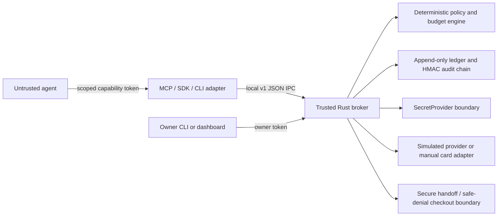

# agent-treasury

`agent-treasury` is a local payment authorization gateway and policy firewall for software agents. It gives an untrusted agent bounded financial autonomy without giving that agent account logins, raw payment credentials, policy mutation rights, or authority to increase its own limits.

The project is local-first and provider-agnostic. The security-critical core is Rust. A versioned JSON-line API over a Unix-domain socket is adapted to MCP, a CLI, a TypeScript SDK, and a dependency-free Python SDK.

## What It Does

- Enforces integer minor-unit money arithmetic and explicit ISO 4217 currencies.
- Separates the owner, agent, broker, and financial-provider principals.
- Supports observe, approval-required, bounded-autonomous, and disabled modes.
- Applies deterministic budgets, merchant and currency rules, fulfillment allowlists, recurring-payment denial, redirect validation, pre-submit revalidation, and emergency stop.
- Uses scoped, expiring, revocable agent capability tokens stored hashed in the broker state.
- Provides an append-only ledger, HMAC hash-chain audit log, and HMAC-authenticated state envelope.
- Quarantines ambiguous payments as `unknown` or `reconciliation_required` and never retries them automatically.
- Includes a deterministic simulated provider, a manual prepaid-card adapter boundary, a hostile local merchant fixture, a loopback-only owner dashboard, MCP tools, SDKs, and a fully local demo.

## What It Is Not

This is not a bank, wallet, issuer, payment processor, money transmitter, KOHO API, KOHO partner, Mastercard or Interac product, custodial service, or universal checkout system. It is not a claim of PCI DSS certification, PCI compliance, formal security certification, or universal merchant compatibility. KOHO and Mastercard are unaffiliated products and trademarks of their respective owners.

The first real-world configuration is a manual adapter for a user-owned Canadian KOHO prepaid virtual Mastercard and an owner-configured Interac e-Transfer receiving address. There is no KOHO login automation, private API use, outgoing Interac e-Transfer support, or real-money test.

## Quickstart

Requirements: Rust stable, Node.js 20 or newer, npm, and Python 3.11 or newer. The simulated demo needs no account, paid service, API key, or network connection after dependencies are installed.

```bash
cargo build --locked
npm ci
./scripts/demo
./scripts/verify
```

The demo proves a valid bounded purchase, duplicate idempotency protection, over-budget denial, recurring denial, currency substitution denial, merchant-controlled-form approval gating, emergency stop, a valid audit chain, and a secret-canary result without printing the synthetic PAN or CVV.

## Persisted Local Setup

Tokens are read from protected files, not command-line values. The following creates a simulated treasury and a bounded agent:

```bash
mkdir -p .local
target/debug/treasury init --data-dir .local --owner-token-file .local/owner.token
target/debug/treasury create-agent --data-dir .local --owner-token-file .local/owner.token \
  --agent-token-file .local/agent.token --mode bounded_autonomous
target/debug/treasury arm-session --data-dir .local --owner-token-file .local/owner.token \
  --agent-id AGENT_ID --ttl-secs 600
target/debug/treasury update-policy --data-dir .local --owner-token-file .local/owner.token \
  --agent-id AGENT_ID --policy-file policy.json
target/debug/treasury approve-merchant --data-dir .local \
  --owner-token-file .local/owner.token --agent-id AGENT_ID \
  --merchant-domain merchant.example.test
target/debug/treasury configure-receive --data-dir .local \
  --owner-token-file .local/owner.token --address public-inbox@example.invalid
target/debug/treasury serve --data-dir .local
```

Run the agent-facing MCP server in a separate process with:

```bash
TREASURY_SOCKET_PATH="$PWD/.local/treasury.sock" \
TREASURY_AGENT_TOKEN_FILE="$PWD/.local/agent.token" \
node packages/mcp-server/dist/index.js
```

The owner dashboard is an optional loopback-only bridge:

```bash
umask 077
openssl rand -hex 32 > .local/dashboard.token
python3 apps/owner-dashboard/server.py \
  --socket-path "$PWD/.local/owner.sock" \
  --owner-token-file "$PWD/.local/owner.token" \
  --access-token-file "$PWD/.local/dashboard.token"
```

The browser prompts for HTTP Basic authentication. Use username `owner` and the separate dashboard access token as the password. Startup rejects reuse of the broker owner credential as the dashboard credential. CSRF, origin, host, and authenticated session checks remain additional controls. The daemon reserves a distinct `owner.sock` control channel that is not shared with the agent connection pool; give agents only `treasury.sock`. The dashboard has no CDN, analytics, third-party script, public bind, or agent endpoint. Stop the daemon and manually lock or replace a real card after a risky run.

Configure a reference-only manual prepaid card without supplying card data:

```bash
target/debug/treasury configure-manual-provider --data-dir .local \
  --owner-token-file .local/owner.token \
  --credential-reference keychain://agent-treasury/card \
  --provider-kind os-credential-store --last-four 1111 \
  --balance-minor 5000 --balance-status owner_confirmed
```

The credential reference identifies an owner-controlled helper entry. It is not a PAN or CVV. Manual-provider purchases always require owner approval and finish in an ambiguous reconciliation state because the project does not submit a real card payment.

Owner and agent credentials must be written to their required protected token files. The CLI never prints either credential. Intent approval is scoped to that immutable intent; durable merchant trust requires the separate owner-authenticated `approve-merchant` command.

## Architecture



The agent-facing surface does not register owner operations. The raw card number, CVV, billing identity, shipping identity, account login, and security settings are outside the agent capability model. See [docs/architecture.md](docs/architecture.md) and [THREAT_MODEL.md](THREAT_MODEL.md).

## Agent Operations

The MCP server exposes only:

- `treasury_get_status`
- `treasury_get_capabilities`
- `treasury_get_budget`
- `treasury_get_receive_instructions`
- `treasury_create_purchase_intent`
- `treasury_get_purchase_intent`
- `treasury_execute_purchase_intent`
- `treasury_cancel_purchase_intent`
- `treasury_list_transactions`
- `treasury_get_receipt`

The owner-only operations for policy changes, agent creation and revocation, approvals, deposits, reconciliation, provider setup, audit export, and emergency stop are implemented in the Rust core and CLI but are not exposed by the MCP server.

## Security Warnings

- Treat the agent and all merchant content as compromised input.
- Do not place real credentials in fixtures, environment variables, shell arguments, logs, browser profiles, screenshots, traces, or MCP output.
- The default secret provider does not persist CVV. Encrypted CVV storage is not automatically compliant and is not implemented here.
- A manual card balance is owner-confirmed or estimated, not an authoritative provider balance.
- A compromised local administrator, kernel, browser runtime, issuer, merchant, or owner is outside some guarantees.
- Payments that time out after submission are unknown and require owner reconciliation. An `executing` intent is persisted before provider submission, and restart recovery quarantines it rather than retrying.
- Caller-provided `session_id` values are metadata only. Budget sessions are broker-issued, owner-armed, expiring, and bound to the agent capability.

## KOHO Reference Setup

Read [docs/koho-setup.md](docs/koho-setup.md) for the dated, manual-only Canadian setup and current official-source links. Read [docs/limitations.md](docs/limitations.md) before using any real card. Do not share a KOHO password, verification code, card number, CVV, recovery information, or government identity data with this project or an agent.

## Project Status

This is a security-focused reference implementation intended for human review before any real-money experiment. It has no real provider automation, no payment processor integration, no public network default, and no claim of certification. The canonical verification path is `./scripts/verify`; a green result is evidence about this checkout, not a security warranty.

No real transaction has been made by this repository or its verification harness.

## License

Apache-2.0. See [LICENSE](LICENSE). Dependency licenses are checked against the locked graph by the verification harness.
