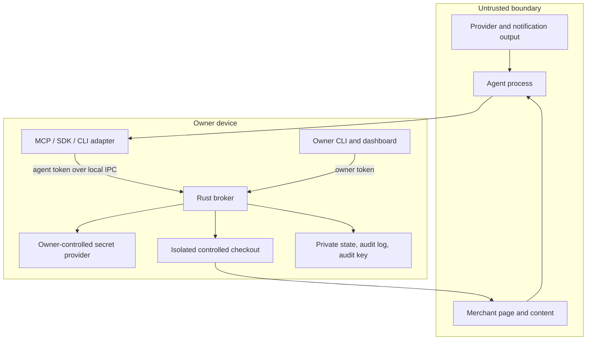
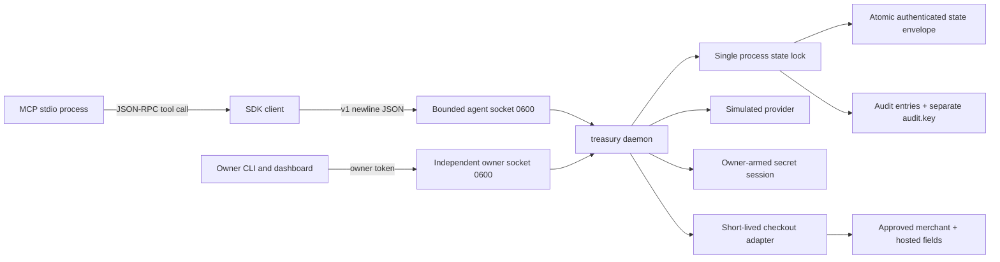
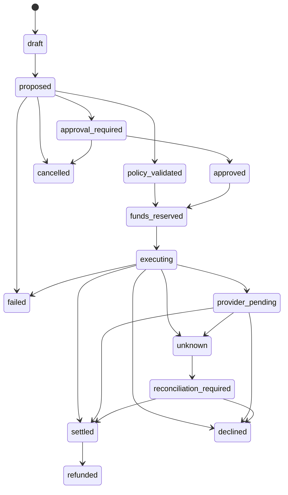
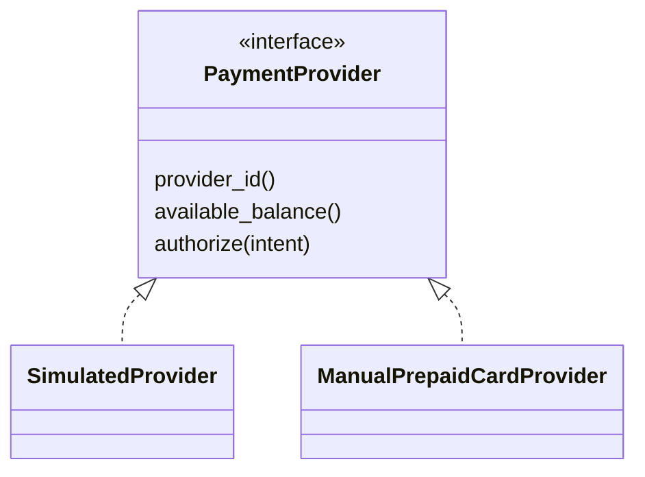

# Architecture

## Principals and Trust Boundaries



The agent, merchant, notifications, screenshots, and model traces are never trusted for security decisions. The broker revalidates amount, currency, origin, fulfillment, and policy immediately before execution. Real checkout adds an owner profile and independent visible-page validation inside the isolated checkout process.

## Process Architecture



The daemon owns an exclusive data-directory lock for its lifetime and serializes requests in one process. CLI mutations route through the independently admitted owner socket or acquire the same lock when the daemon is offline. The agent socket rejects owner operations, and the owner socket rejects non-owner credentials. State and audit entries are covered by an HMAC-authenticated envelope; writes use a random private temporary file, `sync_all`, atomic rename, and parent-directory synchronization. Both sockets are local by construction and are not public TCP listeners.

Before a provider call, the broker persists `funds_reserved` and `executing`. The verified `final_total`, rather than the earlier requested estimate, is the authoritative value for policy limits, reservations, provider submission, reconciliation, ledger events, and receipts. If the process exits before the final outcome is durable, restart recovery changes `executing` to `unknown` and forbids automatic resubmission. The intent ID is the provider idempotency key in the simulated adapter.

## Purchase State Machine



There is no transition from `unknown` back to `executing`. A timeout after submission is an owner reconciliation task, not a retry opportunity.

## Secure Checkout Critical Section

```mermaid
sequenceDiagram
  participant A as Agent
  participant B as Broker
  participant E as Executor
  participant S as SecretProvider
  participant P as Provider
  A->>B: create intent
  B->>B: deterministic policy and schema validation
  A->>B: execute intent
  B->>E: suspend agent control and validate origin/total
  B->>B: reserve funds and revalidate policy
  B->>S: owner-controlled just-in-time secret request
  S-->>E: volatile secret, not agent-readable
  E->>P: submit exactly once
  P-->>E: approved, pending, declined, or ambiguous
  E-->>B: sanitized outcome
  B->>S: clear transaction secret
  B->>B: append ledger and audit; destroy/sanitize context
  B-->>A: sanitized receipt or reconciliation state
```

The default simulator exercises the state shape with synthetic facts and no money. Manual-provider checkout is owner-approved by default. The owner may explicitly enable controlled checkout for policy-validated intents, but only a unique owner profile and an active owner-armed card session can make that path executable. The Playwright adapter independently observes configured checkout facts, leaves capture channels disabled, and destroys its fresh context. Unknown forms, unavailable owner authentication, or ambiguous observations return an explicit unsupported or reconciliation result.

## Provider Abstraction



The manual adapter is selectable through the owner CLI or console. It stores a non-secret credential reference, masked metadata, controlled-checkout flag, and freshness-limited balance snapshot, not a login or private issuer session. Estimated or expired snapshots cannot authorize spending. A controlled browser submission still returns an ambiguous outcome because merchant DOM is not issuer evidence; the owner controls final reconciliation.

## Owner Versus Agent Interfaces

| Capability | Agent | Owner |
| --- | --- | --- |
| Read effective budget | Yes | Yes |
| Read public receiving instructions | Yes | Yes |
| Create and execute a bounded intent | Yes, policy-bound | Yes, through owner workflow |
| Cancel own unexecuted intent | Yes | Yes |
| Create or revoke agents | No | Yes |
| Change policy or limits | No | Yes |
| Approve exception | No | Yes |
| Record or verify income | No | Yes |
| Reconcile unknown transaction | No | Yes |
| Read credentials or audit key | No | No normal agent or dashboard path |
| Emergency stop | No | Yes |
