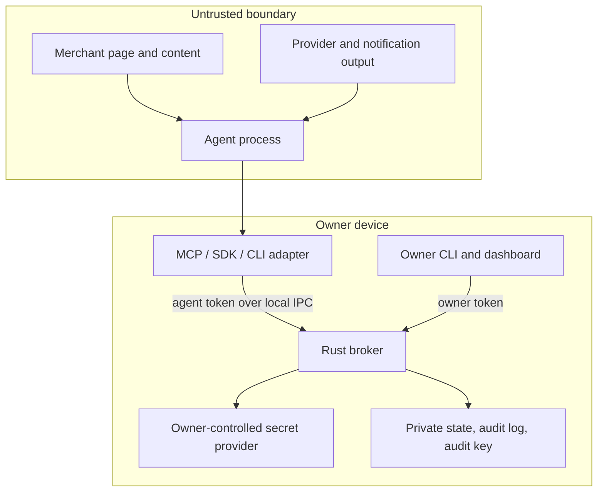
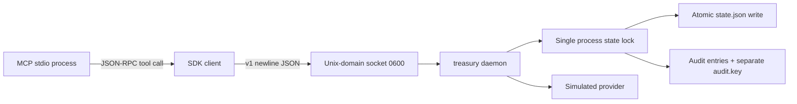
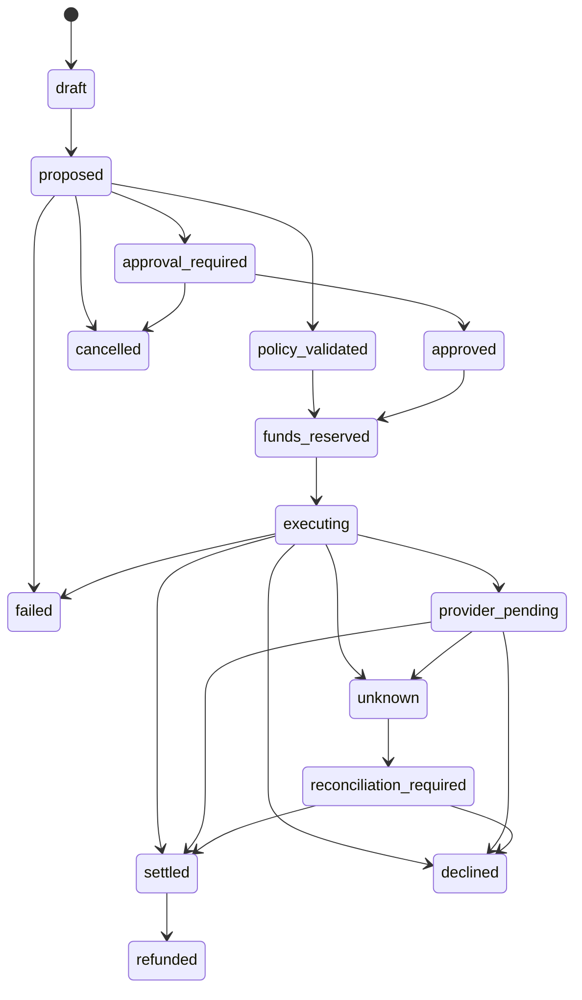
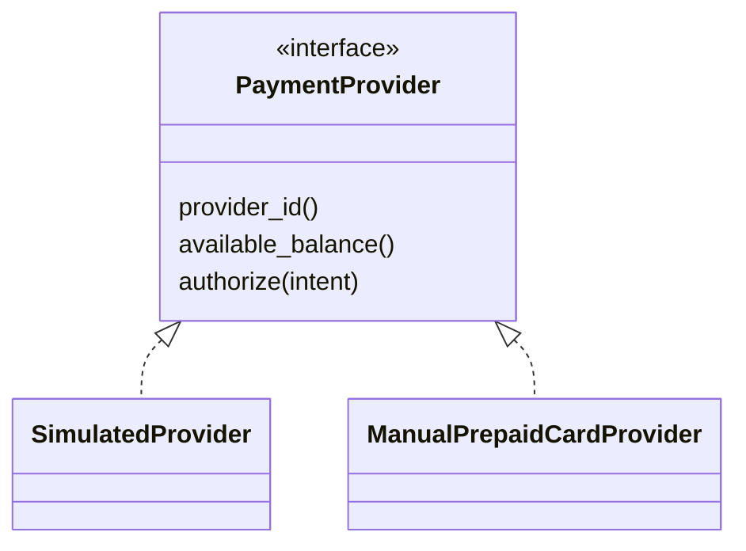

# Architecture

## Principals and Trust Boundaries



The agent, merchant, notifications, screenshots, and model traces are never trusted for security decisions. The broker revalidates amount, currency, origin, fulfillment, and policy immediately before the simulated provider call.

## Process Architecture



The daemon serializes requests in one process. State writes use a temporary file, `sync_all`, private permissions, and rename. The socket is loopback-local by construction and is not a public TCP listener.

## Purchase State Machine



There is no transition from `unknown` back to `executing`. A timeout after submission is an owner reconciliation task, not a retry opportunity.

## Secure Checkout Critical Section

```mermaid
sequenceDiagram
  participant A as Agent
  participant B as Broker
  participant E as Executor
  participant S as SecretProvider
  participant P as Provider
  A->>B: create intent
  B->>B: deterministic policy and schema validation
  A->>B: execute intent
  B->>E: suspend agent control and validate origin/total
  B->>B: reserve funds and revalidate policy
  B->>S: owner-controlled just-in-time secret request
  S-->>E: volatile secret, not agent-readable
  E->>P: submit exactly once
  P-->>E: approved, pending, declined, or ambiguous
  E-->>B: sanitized outcome
  B->>S: clear transaction secret
  B->>B: append ledger and audit; destroy/sanitize context
  B-->>A: sanitized receipt or reconciliation state
```

The default simulated executor follows this shape. A real browser executor must prove it can revoke agent browser control, prevent secret capture in traces and screenshots, prevent DOM or autofill reads, and destroy the profile. If it cannot prove those properties, it must return an explicit unsupported or approval-required result.

## Provider Abstraction



The manual adapter stores a secret reference and an owner-confirmed balance snapshot, not a login or private issuer session. It returns an ambiguous/manual outcome for submission so the owner controls the real checkout and reconciliation.

## Owner Versus Agent Interfaces

| Capability | Agent | Owner |
| --- | --- | --- |
| Read effective budget | Yes | Yes |
| Read public receiving instructions | Yes | Yes |
| Create and execute a bounded intent | Yes, policy-bound | Yes, through owner workflow |
| Cancel own unexecuted intent | Yes | Yes |
| Create or revoke agents | No | Yes |
| Change policy or limits | No | Yes |
| Approve exception | No | Yes |
| Record or verify income | No | Yes |
| Reconcile unknown transaction | No | Yes |
| Read credentials or audit key | No | No normal agent or dashboard path |
| Emergency stop | No | Yes |

